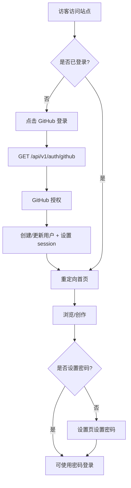
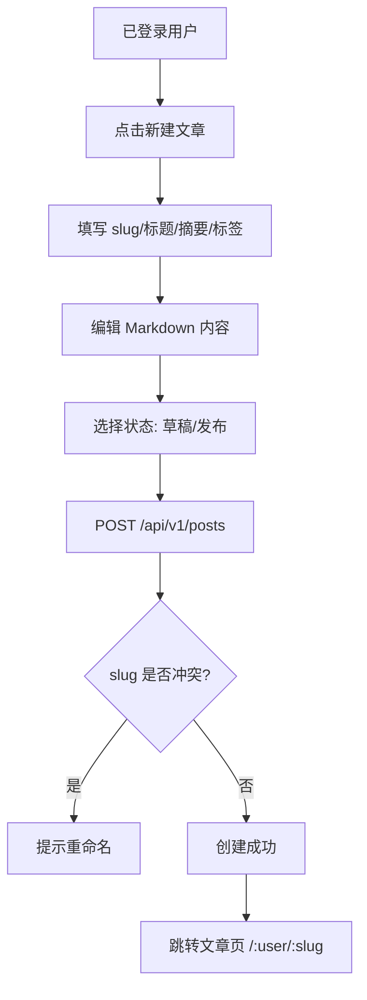
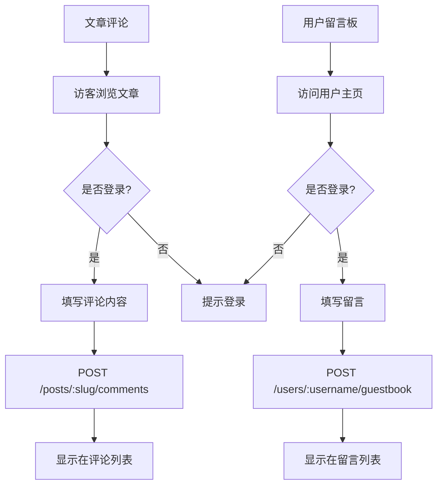

# Coffli 博客项目 - 产品需求文档 (PRD)

## 1. 产品概述

Coffli 是一个面向所有 GitHub 用户的博客创作平台，运行在 Cloudflare Pages + Functions 环境。用户通过 GitHub OAuth 授权注册后即可创作博客文章，支持设置账号密码实现双通道登录。文章使用 Markdown 编写，支持 KaTeX 数学公式、代码语法高亮与 Mermaid 流程图渲染。

- 面向 GitHub 全体用户，鼓励技术博客创作与交流
- 单仓库前后端一体部署，前端通过同源请求访问后端 API
- 默认中文界面，深色可爱风格

## 2. 核心功能

### 2.1 用户角色

| 角色 | 注册方式 | 核心权限 |
|------|---------|---------|
| 访客 | 无需注册 | 浏览文章、查看用户主页、阅读留言板 |
| 已注册用户 | 仅 GitHub OAuth | 创作文章、发表评论、留言板留言、管理个人内容 |
| 管理员 | KV BASIC_AUTH | 管理系统 KV 配置、执行 SQL、查看仪表盘 |

### 2.2 功能模块

1. **首页**: 文章列表、标签筛选、分页、置顶文章
2. **文章详情**: Markdown 渲染、自动目录、评论互动
3. **用户主页**: 资料展示、文章列表、留言板
4. **登录页**: GitHub OAuth 一键登录 + 账号密码登录
5. **设置页**: 编辑个人资料、设置/修改登录密码
6. **文章编辑器**: Markdown 编辑 + 实时预览 + 工具栏
7. **管理后台**: KV 管理、SQL 执行、仪表盘概览

### 2.3 页面详情

| 页面名称 | 模块名称 | 功能描述 |
|---------|---------|---------|
| 首页 | Hero 区 | 站点标题、简介、快速入口按钮 |
| 首页 | 文章列表 | 卡片式文章列表，展示标题、作者、摘要、标签、发布时间、浏览量 |
| 首页 | 标签筛选 | 点击标签筛选相关文章 |
| 首页 | 分页 | 上/下一页导航 |
| 文章详情 | 正文渲染 | Markdown 渲染，支持 KaTeX/代码高亮/Mermaid |
| 文章详情 | 目录导航 | 基于 H2/H3 自动生成侧边目录，点击锚点跳转 |
| 文章详情 | 文章元信息 | 作者、发布时间、浏览量、标签 |
| 文章详情 | 评论区 | 评论列表(支持楼中楼回复)、发表评论、删除自己的评论 |
| 文章详情 | 操作栏 | 作者可编辑/删除自己的文章 |
| 用户主页 | 资料卡片 | 头像、用户名、简介、GitHub 链接 |
| 用户主页 | 文章列表 | 该用户发布的文章 |
| 用户主页 | 留言板 | 访客留言列表(支持回复)、发表留言 |
| 登录页 | GitHub OAuth | 一键登录按钮，跳转授权 |
| 登录页 | 密码登录 | 用户名+密码表单(仅已设置密码的用户) |
| 设置页 | 资料编辑 | 修改 display_name、email、avatar_url、bio |
| 设置页 | 密码管理 | 设置/修改登录密码(≥6位) |
| 文章编辑器 | 编辑区 | Markdown 源码编辑，工具栏(粗体/斜体/标题/链接/图片/代码块/公式/Mermaid) |
| 文章编辑器 | 预览区 | 实时 Markdown 渲染预览 |
| 文章编辑器 | 元信息 | slug、标题、摘要、标签、状态(草稿/发布)、置顶 |
| 管理后台 | 仪表盘 | KV 键数量、文章数、用户数统计 |
| 管理后台 | KV 管理 | 列表/查看/编辑/删除 KV 键值 |
| 管理后台 | SQL 执行 | 执行 SQL 语句并展示结果 |

## 3. 核心流程

### 3.1 认证流程

用户首次访问 → 点击"使用 GitHub 登录" → 跳转 `/api/v1/auth/github` → GitHub 授权页 → 回调创建/更新用户 → 设置 session cookie → 重定向首页。

已设置密码的用户 → 登录页输入用户名密码 → `POST /api/v1/auth/login` → 验证成功 → 设置 session → 进入首页。

已登录用户 → 设置页设置密码 → `POST /api/v1/auth/password` → 后续可使用密码登录。

### 3.2 文章创作流程

### 3.3 评论与留言流程

## 4. 用户界面设计

### 4.1 设计风格

- **主题色**: `#45969c` (青绿色)，作为按钮、链接、强调元素主色
- **默认配色**: 深色模式 (默认开启)
  - 背景色: 深炭黑 `#0f1419`
  - 卡片表面: `#1a2330` / `#1e2a35`
  - 主色: `#45969c`
  - 主色悬停: `#5a acb1` (提亮)
  - 文字主色: `#e4e6eb`
  - 次要文字: `#9ca3af`
  - 边框: `#2d3748`
- **风格**: 可爱风格 — 大圆角 (14-16px)、柔和投影、微妙渐变、玻璃拟态点缀
- **按钮**: 圆角胶囊/圆角矩形，主色填充 + 悬停提亮 + 柔和阴影
- **字体**:
  - 标题: `Quicksand` (圆润可爱)
  - 正文: `Noto Sans SC` (中文清晰可读)
  - 代码: `JetBrains Mono`
- **布局**: 顶部导航 + 居中内容容器 (max-width 1100px) + 卡片式列表
- **图标**: `lucide-vue-next` (线性图标，统一描边)
- **动效**: 页面切换淡入、卡片悬停上浮、按钮按压反馈

### 4.2 页面设计概览

| 页面 | 模块 | UI 元素 |
|------|------|---------|
| 首页 | Hero | 渐变背景、站点标题(Quicksand 大号)、副标题、GitHub 登录按钮 |
| 首页 | 文章卡片 | 圆角卡片、标签胶囊、作者头像+用户名、悬停上浮 |
| 文章详情 | 正文 | 820px 阅读宽度、舒适行高(1.8)、代码块圆角带复制按钮 |
| 文章详情 | 目录 | 右侧粘性定位、当前章节高亮 |
| 登录页 | 中央卡片 | 玻璃拟态卡片、GitHub 按钮(深色)、密码表单切换 |
| 编辑器 | 双栏 | 左编辑/右预览，可切换全屏，工具栏顶部固定 |
| 管理后台 | 标签页 | 顶部 Tab 切换，功能优先(不追求美观) |

### 4.3 响应式

- 桌面优先 (≥1024px 完整布局)
- 平板 (768-1024px): 目录折叠、双栏改单栏
- 移动端 (<768px): 导航汉堡菜单、卡片单列、编辑器预览抽屉式

## 5. 技术约束

- 运行环境: Cloudflare Pages + Functions，前后端同源
- 认证: 仅 GitHub OAuth 注册，密码为可选附加登录方式
- 文章 URL: `/:user/:slug` (前端路由，后端按 `:slug` 查询)
- 包管理器: pnpm
- 默认语言: 中文 (本期不实现 i18n)
- 后端可破坏性更改 (测试阶段，无需向下兼容)
