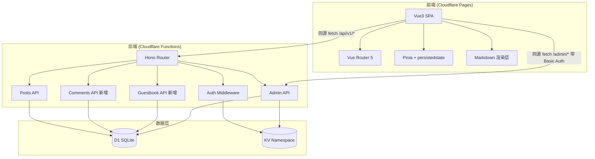

# Coffli 博客项目 - 技术架构文档

## 1. 架构设计



## 2. 技术栈

- **前端**: Vue@3 + Vite + Tailwind CSS + lucide-vue-next
- **状态管理**: Pinia + pinia-plugin-persistedstate
- **路由**: Vue Router 5
- **Markdown**: markdown-it + @mdit/plugin-katex (KaTeX) + highlight.js + mermaid
- **后端**: Hono (现有) + D1 + KV
- **构建**: Vite → `frontend/dist`，Cloudflare Pages 部署
- **包管理**: pnpm
- **初始化工具**: `pnpm create vite` (vue-ts 模板)

## 3. 前端路由定义

| 路由 | 名称 | 用途 | 鉴权 |
|------|------|------|------|
| `/` | home | 首页，文章列表 + 标签筛选 | 公开 |
| `/login` | login | 登录页 (GitHub OAuth + 密码) | 公开 |
| `/new` | post-new | 新建文章编辑器 | requireAuth |
| `/:user` | user | 用户主页 + 文章列表 + 留言板 | 公开 |
| `/:user/:slug` | post | 文章详情 + 评论 | 公开 |
| `/:user/:slug/edit` | post-edit | 编辑文章 | requireAuth (作者/管理员) |
| `/settings` | settings | 个人资料编辑 + 密码管理 | requireAuth |
| `/admin` | admin | 管理后台 (单页 Tab) | KV Basic Auth |
| `/:pathMatch(.*)*` | not-found | 404 页 | 公开 |

**路由优先级**: 静态段 (`/login`, `/new`, `/settings`, `/admin`) 优先于动态段 (`/:user`, `/:user/:slug`)，Vue Router 自动按此顺序匹配。

## 4. API 定义

### 4.1 现有接口 (按需调整)

**认证**
- `GET /api/v1/auth/github` — GitHub OAuth 发起 + 回调 (单路由)
- `POST /api/v1/auth/login` — `{ username, password }` → `{ message, user }`
- `POST /api/v1/auth/logout` — 清除 session
- `GET /api/v1/auth/me` — 获取当前用户 `{ user }`
- `POST /api/v1/auth/password` — `{ password }` 设置密码 (≥6位)

**文章** (调整: 响应附带 author 对象)
- `GET /api/v1/posts?status=&limit=&offset=&author=` → `{ posts: Post[] }`
- `GET /api/v1/posts/tags/all` → `{ tags: Tag[] }`
- `GET /api/v1/posts/:slug` → `{ post: Post }` (附带 author + tags)
- `POST /api/v1/posts` — `{ slug, title, content, summary?, status?, tags?, published_at? }`
- `PUT /api/v1/posts/:slug` — `{ title?, content?, summary?, status?, is_pinned?, tags? }`
- `DELETE /api/v1/posts/:slug`

**用户**
- `PATCH /api/v1/users/me` — `{ display_name?, email?, avatar_url?, bio? }`
- `DELETE /api/v1/users/me`
- `GET /api/v1/users/:username` → `{ user }`

### 4.2 新增接口 (评论)

- `GET /api/v1/posts/:slug/comments` → `{ comments: Comment[] }` (公开，含作者信息)
- `POST /api/v1/posts/:slug/comments` — `{ content, parent_id? }` (requireAuth)
- `DELETE /api/v1/comments/:id` — 删除评论 (作者本人或管理员)

### 4.3 新增接口 (留言板)

- `GET /api/v1/users/:username/guestbook` → `{ messages: GuestbookMessage[] }` (公开，含作者信息)
- `POST /api/v1/users/:username/guestbook` — `{ content, parent_id? }` (requireAuth)
- `DELETE /api/v1/guestbook/:id` — 删除留言 (留言作者 或 主页主人 或 管理员)

### 4.4 数据结构

```typescript
// 文章 (调整后附带 author)
interface Post {
  id: number
  author_id: number
  author: Author         // 新增
  slug: string
  title: string
  content: string        // Markdown 源码
  summary: string | null
  cover_image_url: string | null
  status: 'draft' | 'published' | 'archived'
  is_pinned: boolean
  view_count: number
  tags: Tag[]
  created_at: string
  updated_at: string
  published_at: string | null
}

interface Author {
  id: number
  github_login: string
  display_name: string | null
  avatar_url: string | null
}

interface Tag { id: number; name: string; slug: string }

interface Comment {
  id: number
  post_id: number
  author: Author
  parent_id: number | null
  content: string
  is_approved: boolean
  created_at: string
  updated_at: string
  replies?: Comment[]
}

interface GuestbookMessage {
  id: number
  owner: Author         // 主页主人
  author: Author         // 留言者
  parent_id: number | null
  content: string
  is_approved: boolean
  created_at: string
  updated_at: string
  replies?: GuestbookMessage[]
}

// 统一响应
interface ApiSuccess<T> { data: T; meta?: Record<string, unknown> }
interface ApiError { error: { code: string; message?: string } }
```

## 5. 后端改动清单 (可破坏性更改)

### 5.1 Posts 接口附带 author

在 `getPosts` / `getPostBySlug` / `createPost` / `updatePost` 的查询中 JOIN users 表，返回时附带 `author` 对象。涉及文件:
- `backend/src/utils/sql.ts` — 修改查询 SQL 与结果映射
- `backend/src/types/sql.ts` — Post 接口新增 author 字段
- `backend/src/api/v1/posts/index.ts` — 响应结构无需改动 (直接返回)

### 5.2 新增 Comments 路由

新建 `backend/src/api/v1/comments/index.ts`，挂载到 v1 路由。复用已有 `getCommentsByPostId` / `createComment` SQL 函数，补充:
- 按 post_id 查询评论 (含 author JOIN)
- 创建评论 (requireAuth)
- 删除评论 (requireAuth + 权限校验)

### 5.3 新增 Guestbook 表与路由

新建 `guestbook` 表:

```sql
CREATE TABLE IF NOT EXISTS guestbook (
  id INTEGER PRIMARY KEY AUTOINCREMENT,
  owner_id INTEGER NOT NULL,
  author_id INTEGER NOT NULL,
  parent_id INTEGER,
  content TEXT NOT NULL,
  is_approved BOOLEAN DEFAULT 1,
  created_at TEXT DEFAULT (datetime('now')),
  updated_at TEXT DEFAULT (datetime('now')),
  FOREIGN KEY (owner_id) REFERENCES users(id) ON DELETE CASCADE,
  FOREIGN KEY (author_id) REFERENCES users(id) ON DELETE CASCADE,
  FOREIGN KEY (parent_id) REFERENCES guestbook(id) ON DELETE CASCADE
);
CREATE INDEX IF NOT EXISTS idx_guestbook_owner ON guestbook(owner_id);
```

新建 `backend/src/api/v1/guestbook/index.ts`，挂载到 v1 路由。新增 SQL 辅助函数。

### 5.4 路由挂载

`backend/src/api/v1/index.ts` 新增:
```typescript
v1.route("/posts/:slug/comments", comments)
v1.route("/users/:username/guestbook", guestbook)
v1.route("/comments", commentsDelete)   // DELETE /api/v1/comments/:id
v1.route("/guestbook", guestbookDelete) // DELETE /api/v1/guestbook/:id
```

## 6. 数据模型

```mermaid
erDiagram
    users ||--o{ posts : "authors"
    users ||--o{ sessions : "owns"
    users ||--o{ comments : "writes"
    users ||--o{ guestbook : "owner"
    users ||--o{ guestbook : "author"
    posts ||--o{ post_tags : "has"
    tags ||--o{ post_tags : "tagged"
    posts ||--o{ comments : "receives"
    comments ||--o{ comments : "parent_of"
    guestbook ||--o{ guestbook : "parent_of"
    users {
        id INTEGER PK
        github_id TEXT UK
        github_login TEXT UK
        email TEXT
        display_name TEXT
        avatar_url TEXT
        bio TEXT
        password_hash TEXT
        role TEXT
    }
    posts {
        id INTEGER PK
        author_id FK
        slug TEXT UK
        title TEXT
        content TEXT
        status TEXT
        is_pinned BOOLEAN
        view_count INTEGER
        published_at TEXT
    }
    comments {
        id INTEGER PK
        post_id FK
        user_id FK
        parent_id FK
        content TEXT
        is_approved BOOLEAN
    }
    guestbook {
        id INTEGER PK
        owner_id FK
        author_id FK
        parent_id FK
        content TEXT
        is_approved BOOLEAN
    }
```

## 7. 前端目录结构

```
frontend/
├── index.html
├── package.json
├── vite.config.ts
├── tailwind.config.js
├── postcss.config.js
├── tsconfig.json
├── tsconfig.app.json
├── tsconfig.node.json
├── env.d.ts
├── public/
│   └── favicon.ico
└── src/
    ├── main.ts
    ├── App.vue
    ├── style.css                  # Tailwind 入口 + 全局样式
    ├── assets/
    │   └── fonts/                  # 自定义字体
    ├── api/
    │   ├── client.ts              # fetch 封装 (credentials, 错误处理)
    │   ├── auth.ts                # 认证相关 API
    │   ├── posts.ts               # 文章 API
    │   ├── users.ts               # 用户 API
    │   ├── comments.ts            # 评论 API
    │   └── guestbook.ts          # 留言板 API
    ├── router/
    │   └── index.ts               # Vue Router 5 配置 + 守卫
    ├── stores/
    │   ├── user.ts                # 当前用户 (persisted)
    │   └── ui.ts                  # UI 状态 (toast/modal)
    ├── composables/
    │   ├── useToast.ts
    │   └── useMarkdown.ts         # Markdown 渲染封装
    ├── components/
    │   ├── layout/
    │   │   ├── AppHeader.vue
    │   │   └── AppFooter.vue
    │   ├── post/
    │   │   ├── PostCard.vue
    │   │   ├── PostToc.vue
    │   │   └── PostActions.vue
    │   ├── markdown/
    │   │   ├── MarkdownRenderer.vue
    │   │   └── MarkdownEditor.vue
    │   ├── comment/
    │   │   ├── CommentList.vue
    │   │   ├── CommentItem.vue
    │   │   └── CommentForm.vue
    │   ├── guestbook/
    │   │   ├── GuestbookList.vue
    │   │   └── GuestbookForm.vue
    │   ├── common/
    │   │   ├── UserAvatar.vue
    │   │   ├── TagBadge.vue
    │   │   ├── Pagination.vue
    │   │   ├── LoadingSpinner.vue
    │   │   ├── EmptyState.vue
    │   │   └── ConfirmDialog.vue
    │   └── admin/
    │       ├── DashboardTab.vue
    │       ├── KvTab.vue
    │       └── SqlTab.vue
    ├── pages/
    │   ├── index.vue              # 首页
    │   ├── login.vue              # 登录
    │   ├── new.vue                # 新建文章
    │   ├── settings.vue           # 设置
    │   ├── admin.vue              # 管理后台 (单页 Tab)
    │   ├── [...404].vue
    │   ├── user/
    │   │   └── [user].vue         # 用户主页
    │   └── post/
    │       ├── [user]/[slug].vue      # 文章详情
    │       └── [user]/[slug]/edit.vue # 编辑
    ├── types/
    │   └── api.ts                 # API 类型定义
    └── utils/
        ├── format.ts              # 日期/时间格式化
        └── highlight.ts           # 代码高亮配置
```

## 8. 前端实现要点

### 8.1 API 客户端

`src/api/client.ts` 封装 fetch:
- 默认 `credentials: 'include'` (携带 session cookie)
- 统一错误处理 (401 → 清除用户状态 → 跳转登录)
- 统一响应解包 (`{ data }` / `{ error }`)
- 管理后台请求附加 `Authorization: Basic ...` 头 (用户名密码存于 sessionStorage)

### 8.2 Markdown 渲染

`useMarkdown` composable:
- 初始化 `markdown-it` 实例
- 集成 `@mdit/plugin-katex` (KaTeX 数学公式)
- 集成 `highlight.js` (代码语法高亮)
- Mermaid: 识别 ` ```mermaid ` 代码块，渲染为 SVG (异步处理)
- 文章详情页使用 `MarkdownRenderer.vue`
- 编辑器使用 `MarkdownEditor.vue` (左编辑右预览)

### 8.3 认证守卫

`router/index.ts` 全局前置守卫:
- `requireAuth` 路由: 检查 userStore，未登录跳转 `/login?redirect=...`
- 已登录访问 `/login`: 重定向首页
- GitHub OAuth 回调后由后端重定向到 `/`，前端自动 `GET /auth/me` 同步用户

### 8.4 Pinia 持久化

`pinia-plugin-persistedstate` 持久化 `userStore` (localStorage)，存储当前用户对象。session 由后端 cookie 管理，前端仅缓存用户信息。

## 9. 部署说明

- `frontend/dist` 由 Vite 构建产物
- Cloudflare Pages 部署 `frontend/dist`，Functions 部署后端 worker
- 开发模式: `vite dev` 代理 `/api` 与 `/admin` 到本地 wrangler dev
